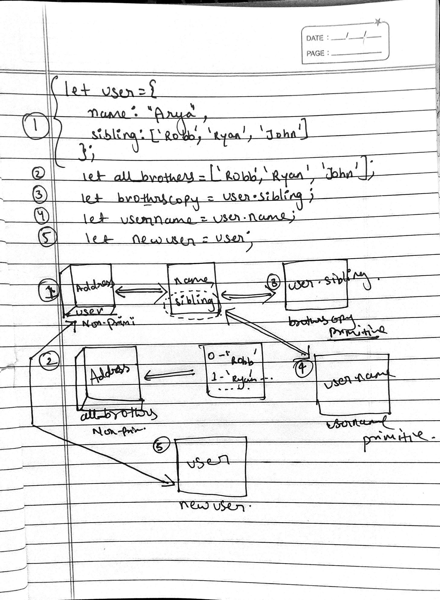

```js
let user = {
  name: 'Arya',
  sibling: ['Robb', 'Ryan', 'John'],
};
let allBrothers = ['Robb', 'Ryan', 'John'];
let brothersCopy = user.sibling;
let usename = user.name;
let newUser = user;
```

1. Memory representation

- Create the memory representation of the above snippet on notebook.
- Take a photo/screenshot and add it to the folder `code`

<!-- To add this image here use  --> 
 

2. Answer the following with reason:

- `user == newUser;` //  true because newUser = user.
- `user === newUser;` // true because newUser = user.
- `user.name === newUser.name;` // true because both of them are pointing towards the same memory location and and value stored inside the key of that object are same that is why the answer is true.
- `user.name == newUser.name;` // true both of them are pointing towards the same memory location and and value stored inside the key of that object are same that is why the answer is true.
- `user.sibling == newUser.sibling;` // true both of them are pointing towards the same memory location and and value stored inside the key of that object are same that is why the answer is true
- `user.sibling === newUser.sibling;` // true both of them are pointing towards the same memory location and and  data value stored inside the key of that object are same that is why the answer is true
- `user.sibling == allBrothers;` // false  beacuse it has diferent address.
- `user.sibling === allBrothers;` //  false  beacuse it has diferent address.
- `brothersCopy === allBrothers;` // false answers are not different.
- `brothersCopy == allBrothers;` // false answers are not different.
- `brothersCopy == user.sibling;` // true memory location of brothers and allBrothers are same.
- `brothersCopy === user.sibling;` // true memory location of brothers and allBrothers are same.
- `brothersCopy[0] === user.sibling[0];` // true  memory location of brothers and allBrothers are same and the value and data type of 0th index is same in both the variables.
- `brothersCopy[1] === user.sibling[1];` // true  memory location of brothers and allBrothers are same and  the value and data type of 1st index is same in both the variables.
- `user.sibling[1] === newUser.sibling[1];` // true  memory location of user.sibling[1] and newUser.sibling[1] are same and  the value and data type of 1st index is same in both the variables.
